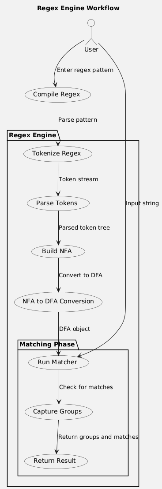

# matchgo

<p float="left">
  
  
  
</p>

A simple and experimental regex engine written in Go. This library is in development, so use it with caution!

## Overview

`matchgo` is a minimalistic regex engine that allows you to compile regex patterns, check strings for matches, and extract matched groups. While this implementation doesn't fully utilize all traditional regex construction techniques, it is inspired by the resources listed below.



## Installation

To add `matchgo` as a dependency:

```shell
go get github.com/Ravikisha/matchgo
```

## Usage

Here’s how to use `matchgo`:

```go
import "github.com/Ravikisha/matchgo"

pattern, err := matchgo.Compile("your-regex-pattern")
if err != nil {
    // handle error
}

result := pattern.Test("your-string")
if result.Matches {
    // Access matched groups by name
    groupMatchString := result.Groups["group-name"]
}
```

To find all matches in a string, use `FindMatches`:

```go
matches := pattern.FindMatches("your-string")
for _, match := range matches {
    // Process each match
    if match.Matches {
        fmt.Println("Match found:", match.Groups)
    }
}
```

## Example

Here’s an example of how to use `matchgo`:

```go
package main

import (
  "fmt"
  "github.com/Ravikisha/matchgo"
)

func main() {
  pattern, err := matchgo.Compile("([a-z]+) ([0-9]+)")
  if err != nil {
    fmt.Println("Error compiling pattern:", err)
    return
  }

  result := pattern.Test("hello 123")
  if result.Matches {
    fmt.Println("Match found:", result.Groups)
  }
}
```

This code will output:

```
Match found: map[0:hello 123 1:hello 2:123]
```

## Features

-  `^` beginning of the string
-  `$` end of the string
-  `.` any single character/wildcard
-  bracket notation
  -  `[ ]` bracket notation/ranges
  -  `[^ ]` bracket negation notation
  -  better handling of bracket expressions, e.g., `[ab-exy12]`
  -  support for special characters in brackets
    -  escape character support
-  quantifiers
  -  `*` none or more times
  -  `+` one or more times
  -  `?` optional
  -  `{m,n}` between `m` and `n` times
-  capturing groups
  -  `( )` capturing groups
  -  `\n` backreference (e.g., `(dog)\1`)
  -  `\k<name>` named backreference
  -  string extraction for matches
-  `\` escape character
  -  special character support (context-dependent)
-  improved error handling
-  multiline support (tested with *Alice in Wonderland* corpus)
  -  `.` does not match newlines (`\n`)
  -  `$` matches newlines (`\n`)
  -  multiple full matches in one text

## Notes

- Escape sequences (`\`) turn the next character into a literal without extended combinations like `\d` or `\b`.
- Backreferences (`\n`) are limited to single-digit references, so `\10` would be interpreted as group `1` followed by a literal `0`.

## Resources

These resources were consulted while developing `matchgo`:

- [Implementing a Regex Engine](https://deniskyashif.com/2019/02/17/implementing-a-regular-expression-engine/)
- [Regular expression - Wikipedia](https://en.wikipedia.org/wiki/Regular_expression)
- [Shunting-yard algorithm - Wikipedia](https://en.wikipedia.org/wiki/Shunting_yard_algorithm)
- [Converting Regular Expressions to Postfix Notation](https://blog.cernera.me/converting-regular-expressions-to-postfix-notation-with-the-shunting-yard-algorithm/)
- [Go by Example](https://gobyexample.com/)
- [Regex101](https://regex101.com/)
- [Thompson’s Construction - Wikipedia](https://en.wikipedia.org/wiki/Thompson%27s_construction)
- [Python re Tests](https://github.com/python/cpython/blob/main/Lib/test/re_tests.py)
- [Microsoft .NET Regex Documentation](https://learn.microsoft.com/en-us/dotnet/standard/base-types/regular-expressions)

> This project was inspired by [rgx](https://rhaeguard.github.io/posts/regex/).